# RAgents: build and deploy guide

Every step taken to build this repo, in order: Firebase project → code in VS Code → first deploy (step 1) →
real model with Firebase AI Logic (step 2) → App Check → deploy → hardening. Each screenshot has the page's URL
on top and the click path to reach it.

**Live site:** https://ragent-eec65.web.app · **Repo:** https://github.com/EasyLearnJava/RAgents ·
**Firebase project:** `RAgent` (ID `ragent-eec65`, free Spark plan)


```mermaid
flowchart LR
  A[1 Firebase project] --> B[2 Tools: Node, Firebase CLI, Git, VS Code]
  B --> C[3 Code step 1 in VS Code]
  C --> D[4 Deploy to Firebase Hosting]
  D --> E[5 Code step 2: Gemini via AI Logic]
  E --> F[6 reCAPTCHA key]
  F --> G[7 Register web app + App Check]
  G --> H[8 Turn on AI Logic + enforce App Check]
  H --> I[9 Deploy + test]
  I --> J[10 Harden]
```

## Contents

1. [Create the Firebase project](#1-create-the-firebase-project)
2. [Install the tools](#2-install-the-tools)
3. [Get the code and write step 1 in VS Code](#3-get-the-code-and-write-step-1-in-vs-code)
4. [Deploy to Firebase Hosting](#4-deploy-to-firebase-hosting)
5. [Write step 2: a real model](#5-write-step-2-a-real-model)
6. [Create the reCAPTCHA (Fraud Defense) key](#6-create-the-recaptcha-fraud-defense-key)
7. [Register the web app and App Check](#7-register-the-web-app-and-app-check)
8. [Turn on Firebase AI Logic and enforce App Check](#8-turn-on-firebase-ai-logic-and-enforce-app-check)
9. [Commit, push, deploy and test](#9-commit-push-deploy-and-test)
10. [Hardening](#10-hardening)
11. [Troubleshooting: every error we hit](#11-troubleshooting-every-error-we-hit)
12. [Everyday commands](#12-everyday-commands)

---

## 1. Create the Firebase project

1. Open https://console.firebase.google.com/ with a **personal** Google account.
2. Click **Create a new Firebase project**, name it `RAgent`, accept the defaults and create it.
   Firebase gives it the ID `ragent-eec65`. It starts on the free **Spark** plan, and we never add billing.

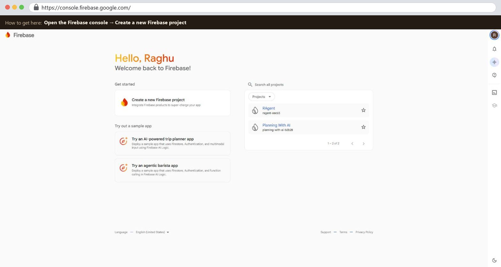

The project overview. The `ragents-web` chip appears later, in [step 7](#7-register-the-web-app-and-app-check):

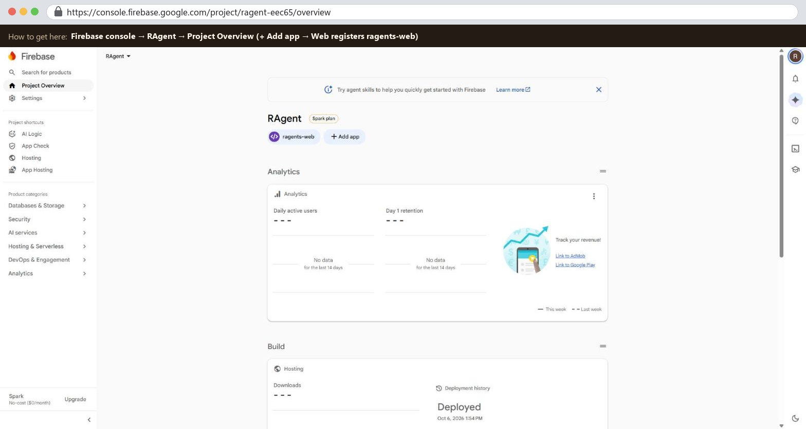

## 2. Install the tools

You need Node.js 22, Git and VS Code. Then, in **Command Prompt**:

```bat
npm install -g firebase-tools
set NODE_OPTIONS=--use-system-ca
firebase login
```

- `firebase login` opens the browser. Sign in with the same personal account. The terminal then shows
  `Success! Logged in as …`.
- `set NODE_OPTIONS=--use-system-ca` is only needed on networks that inspect HTTPS (such as a corporate proxy like
  Zscaler). Without it, `firebase login` and `firebase deploy` fail with certificate errors. It lasts for that
  Command Prompt window only, so run it again in each new window.
- Use a **normal Command Prompt**, not the standalone "Firebase CLI" window. That window bundles an older Node
  (v20) and the deploy fails with `ERR_REQUIRE_ESM` (see [Troubleshooting](#11-troubleshooting-every-error-we-hit)).

## 3. Get the code and write step 1 in VS Code

```bat
cd "C:\Users\<you>\Documents\Personal\Raghu\FDE\Evolution"
git clone https://github.com/EasyLearnJava/RAgents.git
cd RAgents
git config --local user.name "<your name>"
git config --local user.email "<your GitHub email or noreply address>"
code .
```

`--local` sets the commit name and email for **this repo only**, so a work identity set globally on the laptop is
never used here.

The code is written in VS Code. The repo layout:

```text
RAgents/
├─ projects/
│  ├─ 01-hello-world-rules/    step 1: one rule, no model
│  │  ├─ project.json          title, summary, "what you learn" → left nav
│  │  ├─ public/               agent.js (logic) + index.html (chat page)
│  │  ├─ test/agent.test.js
│  │  └─ README.md
│  └─ 02-hello-world-llm/      step 2: Gemini via Firebase AI Logic
├─ shell/index.html            the site: left nav + selected project
├─ scripts/build.mjs           builds dist/ from shell/ + every projects/*/public
├─ scripts/serve.mjs           local preview on http://127.0.0.1:5000
├─ firebase.json               Hosting serves dist/ and runs the build first
└─ .firebaserc                 default project: ragent-eec65
```

Step 1's logic (`projects/01-hello-world-rules/public/agent.js`) is one rule: if the message starts with
hello/hi/hey, reply "Hello World". Otherwise, say it only knows one thing.

Test and preview locally, in Command Prompt from the repo root:

```bat
npm test
npm run serve
```

`npm test` runs every project's tests. `npm run serve` builds and serves the site at http://127.0.0.1:5000
(Ctrl+C stops it).

## 4. Deploy to Firebase Hosting

```bat
set NODE_OPTIONS=--use-system-ca
firebase deploy --only hosting
```

`firebase.json` runs `node scripts/build.mjs` first (the `predeploy` hook), then uploads `dist/`. Each deploy shows
up as a release on the Hosting dashboard:

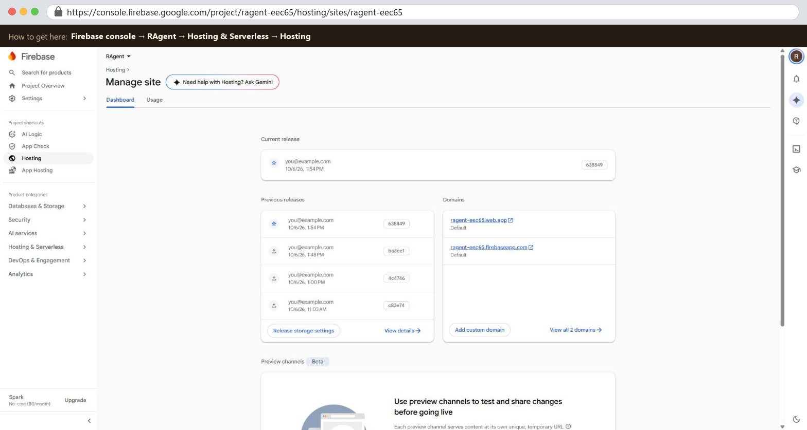

Step 1 live. "Hello" gets "Hello World", and anything else gets the fallback:

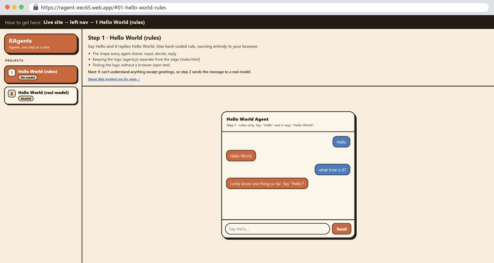

## 5. Write step 2: a real model

Step 2 sends the message to **Gemini** through **Firebase AI Logic**. The Gemini API key stays on Google's side and
never appears in the code. **App Check** proves each request comes from our site.

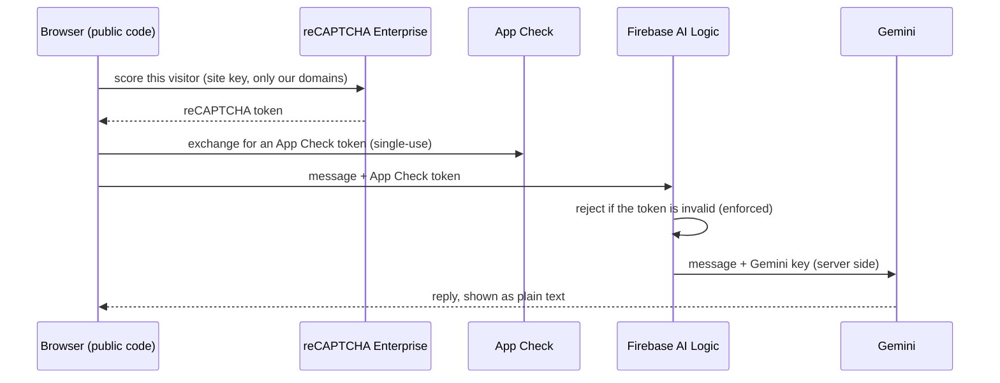
```mermaid
sequenceDiagram
  participant B as Browser (public code)
  participant R as reCAPTCHA Enterprise
  participant AC as App Check
  participant AI as Firebase AI Logic
  participant G as Gemini
  B->>R: score this visitor (site key, only our domains)
  R-->>B: reCAPTCHA token
  B->>AC: exchange for an App Check token (single-use)
  B->>AI: message + App Check token
  AI->>AI: reject if the token is invalid (enforced)
  AI->>G: message + Gemini key (server side)
  G-->>B: reply, shown as plain text
```

Files in `projects/02-hello-world-llm/public/`:

| File | What it does |
|---|---|
| `agent.js` | Input checks (empty, over 500 characters), calls the model, turns errors into friendly messages. No Firebase imports, so it's testable |
| `main.js` | Firebase wiring: config → App Check (reCAPTCHA Enterprise) → AI Logic (`GoogleAIBackend`) → model |
| `ai-config.js` | The only file you edit: `MODEL` and `RECAPTCHA_SITE_KEY`. Neither is a secret |
| `index.html` | Chat page with a status badge (green = connected, red = "setup needed") |

At first `RECAPTCHA_SITE_KEY` is empty, so the page shows **"Setup needed"**. Steps 6–8 fill it in.

## 6. Create the reCAPTCHA (Fraud Defense) key

reCAPTCHA is now called **Fraud Defense** in the Google Cloud console.

1. Open the Google Cloud console with project **RAgent** selected, then go to **☰ → Security → Fraud Defense**.
   If asked, enable the reCAPTCHA Enterprise API.

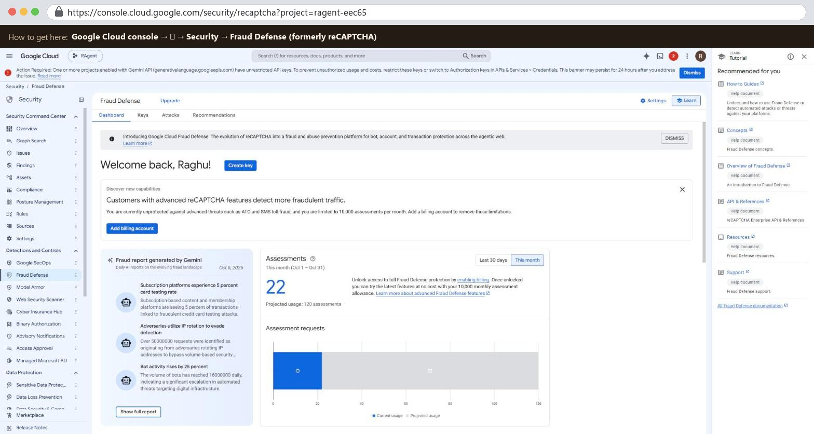

2. Click **Create key**:
   - **Display name:** `ragents-web`.
   - **Application type:** **Web**.
   - **Domains:** `ragent-eec65.web.app` and `ragent-eec65.firebaseapp.com`. We first added `localhost` too, as in the
     screenshot, then removed it in [step 10](#10-hardening). Don't add it.
   - Leave **Challenge** off. It's a score-based key, so visitors never see a checkbox.
   - Click **Create key**.

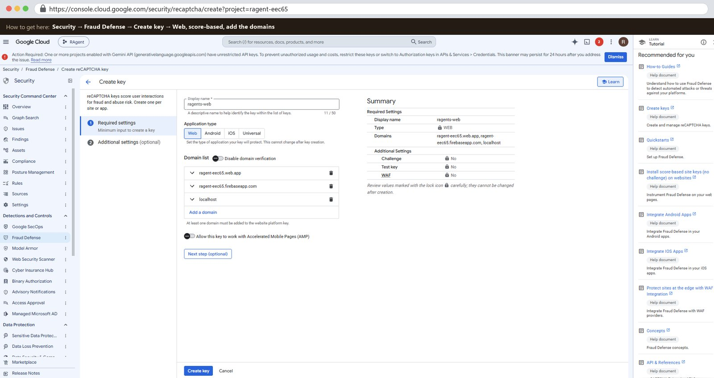

3. Copy the key **ID** (`6LdVR-…`). This is the site key. Ignore the integration snippet on this page:
   Firebase App Check loads reCAPTCHA for us.

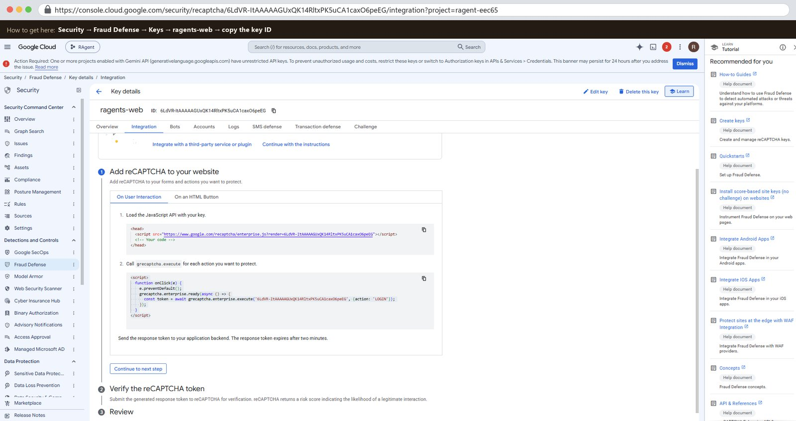

4. Paste the ID into `projects/02-hello-world-llm/public/ai-config.js` → `RECAPTCHA_SITE_KEY`.

Once the site is running, the key's Overview shows **Protected**:

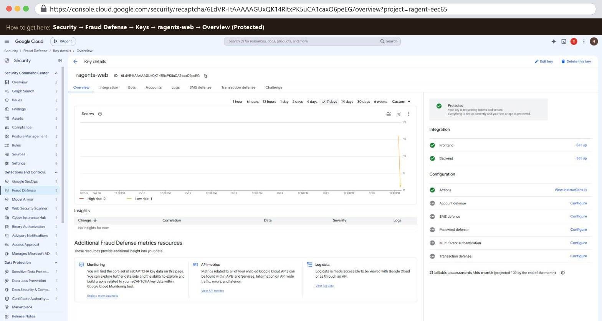

## 7. Register the web app and App Check

1. **Register a web app.** Firebase console → **RAgent → Project Overview → + Add app → Web (`</>`)**:
   - set the nickname to `ragents-web`;
   - leave "Also set up Firebase Hosting" unchecked, because Hosting already exists;
   - click **Register app**, then **Continue to console**.

   You don't need to copy the config snippet: on Firebase Hosting the page loads it from `/__/firebase/init.json`.
2. **App Check.** Go to **Security → App Check → Get started**.

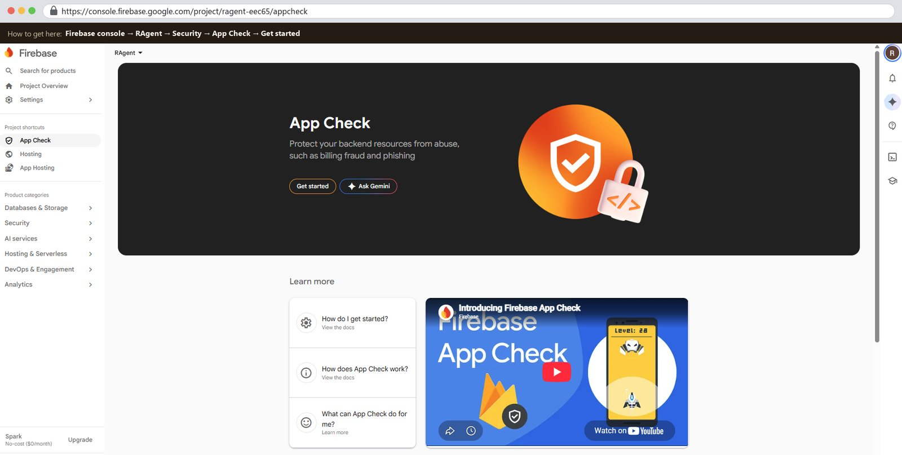

3. On the **Apps** tab:
   - expand `ragents-web` and choose **Fraud Defense (formerly reCAPTCHA Enterprise)**;
   - paste the site key, leave the token lifetime at 1 hour, and click **Save**.

   The status becomes **Registered**:

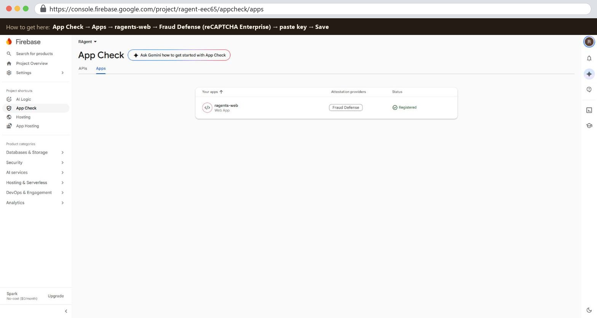

## 8. Turn on Firebase AI Logic and enforce App Check

1. Go to **AI services → AI Logic → Get started** and choose **Gemini Developer API** (no cost, works on Spark).
   Don't pick the Agent Platform option; it needs billing.
2. Click **Enable API**. This accepts the Gemini API terms and **automatically enforces App Check** for AI Logic.
3. *(Optional)* AI monitoring. We turned it on.
4. Click **Finish setup**. **AI Logic → Settings** now shows Gemini Developer API **Enabled**:

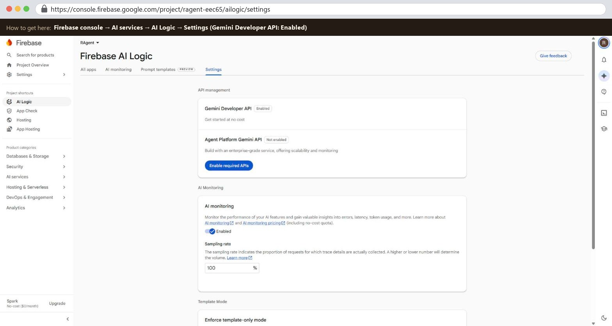

5. Check that **App Check → APIs → Firebase AI Logic** shows **Enforced**:

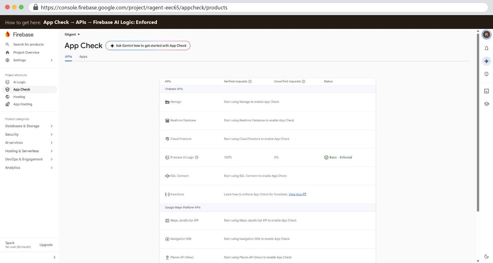

## 9. Commit, push, deploy and test

In Command Prompt from the repo root:

```bat
npm test
git add -A
git commit -m "Add App Check site key for step 2"
git push
set NODE_OPTIONS=--use-system-ca
firebase deploy --only hosting
```

Open https://ragent-eec65.web.app/#02-hello-world-llm. If it still says **"Setup needed"** right after a deploy,
the browser is using old cached files. Press **Ctrl+Shift+R** to reload without the cache.
`firebase.json` now sends `Cache-Control: no-cache` for every file (including pages opened by folder address, like `/projects/02-hello-world-llm/`), so this shouldn't happen again.

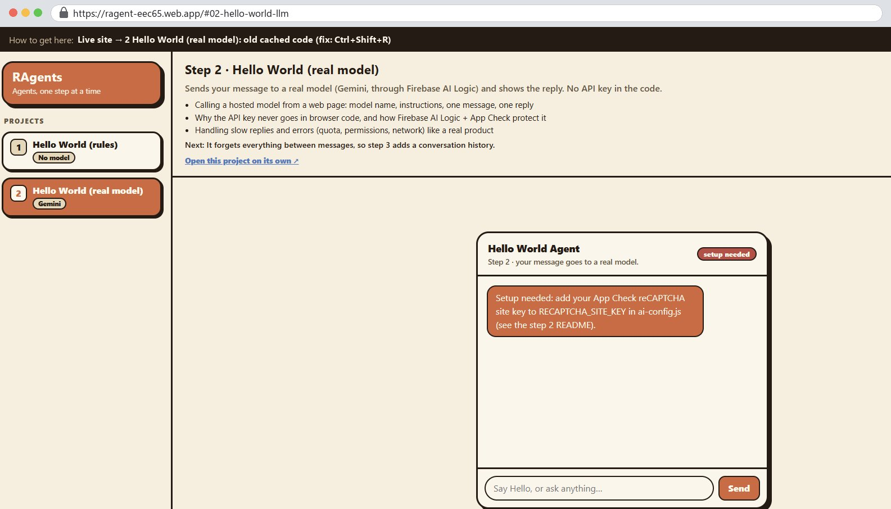

Working: the badge shows the model name in green, and "Hello" gets a reply from Gemini:

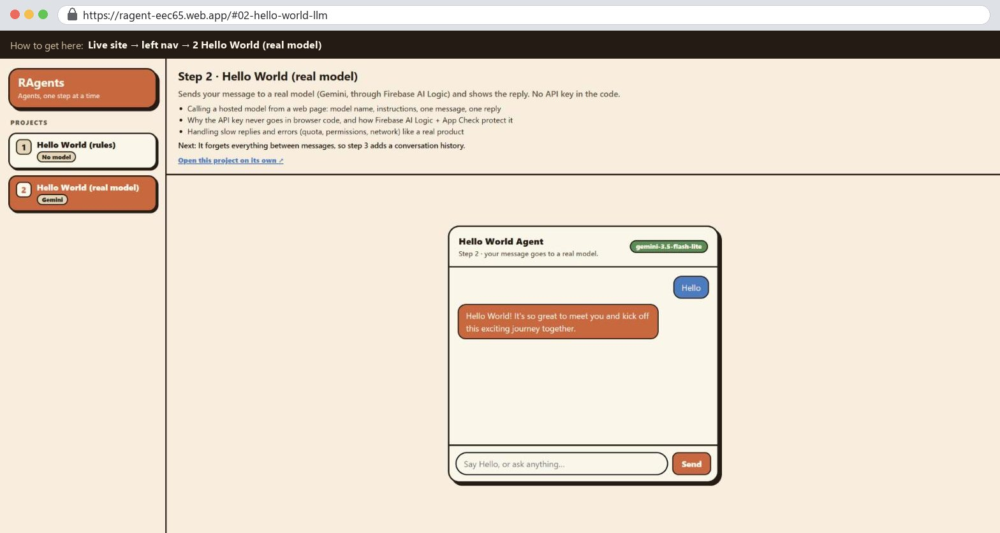

We first used `gemini-3.8-flash`, but on the free tier it kept returning `429` (quota) and `500` (high demand).
We switched `MODEL` to **`gemini-3.5-flash-lite`**, which answered straight away. We also added a friendly
"model is busy" message.

The repo on GitHub:

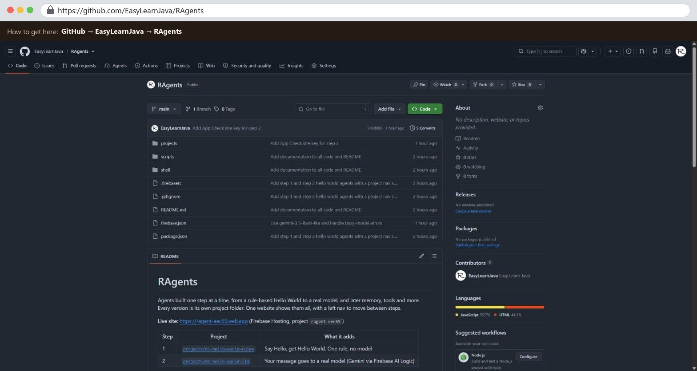

## 10. Hardening

Full reasoning: [`projects/02-hello-world-llm/SAFETY_AND_ABUSE.md`](../projects/02-hello-world-llm/SAFETY_AND_ABUSE.md).

### A. Remove `localhost` from the reCAPTCHA key: done

Otherwise anyone could run a copy of the page on their own `localhost` and pass App Check. Local testing uses an
App Check **debug token** instead.

Steps: **Fraud Defense → Keys → `ragents-web` → Edit key → Domain list → 🗑 `localhost` → Save changes.**

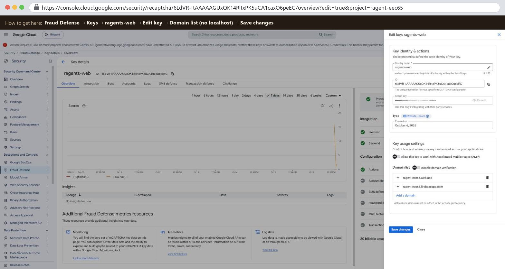

### B. Lower the per-user limit from 100 to 10 requests/minute: to do

One visitor, counted per IP address because there's no sign-in, shouldn't be able to use up the shared free quota.

**Direct link (opens already filtered):**
[Quotas: Firebase AI Logic per-user limit](<https://console.cloud.google.com/iam-admin/quotas?project=ragent-eec65&pageState=(%22allQuotasTable%22:(%22f%22:%22%255B%257B_22k_22_3A_22_22_2C_22t_22_3A10_2C_22v_22_3A_22_5C_22Generate%2520content%2520requests%2520per%2520minute%2520per%2520project%2520per%2520user_5C_22_22%257D_2C%257B_22k_22_3A_22_22_2C_22t_22_3A10_2C_22v_22_3A_22_5C_22Firebase%2520AI%2520Logic_5C_22_22%257D_2C%257B_22k_22_3A_22_22_2C_22t_22_3A10_2C_22v_22_3A_22_5C_22default_5C_22_22%257D%255D%22))>)

Or navigate: **Google Cloud → IAM & Admin → Quotas & System Limits**, then filter for
`Generate content requests per minute per project per user`, `Firebase AI Logic` and `default`.

1. Check the filter shows those 3 chips.
2. Find the row **Firebase AI Logic API · Generate content requests per minute per project per user … (default)**.
   Its **Value** is `100`.
3. Click the **three-dot menu (⋮)** at the end of that row → **Edit quota** → enter **10** → **Submit request**.
   Lowering a limit applies straight away. The value then shows `10`.

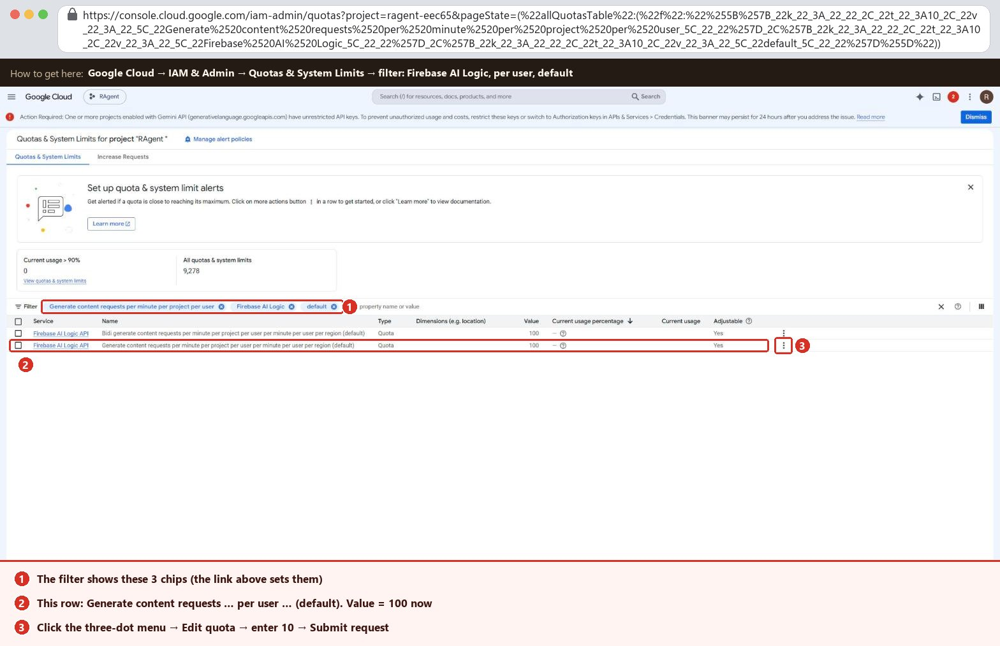

### C. Restrict the browser API key to our websites: to do

Firebase already limited the key to 25 Firebase APIs, and the Gemini API isn't one of them, so leave that list as it is:

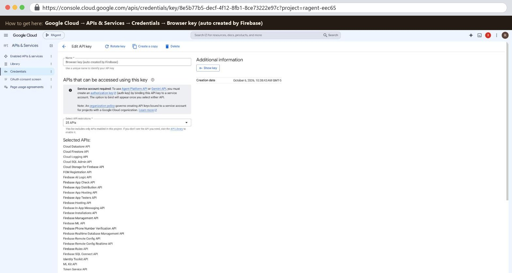

What's missing is **Application restrictions**, which is still set to **None**. Set it to **Websites**, add `https://ragent-eec65.web.app/*` and
`https://ragent-eec65.firebaseapp.com/*`, then **Save**. It takes up to 5 minutes, then test step 2 again.

Steps: **Google Cloud → APIs & Services → Credentials → Browser key (auto created by Firebase)**.

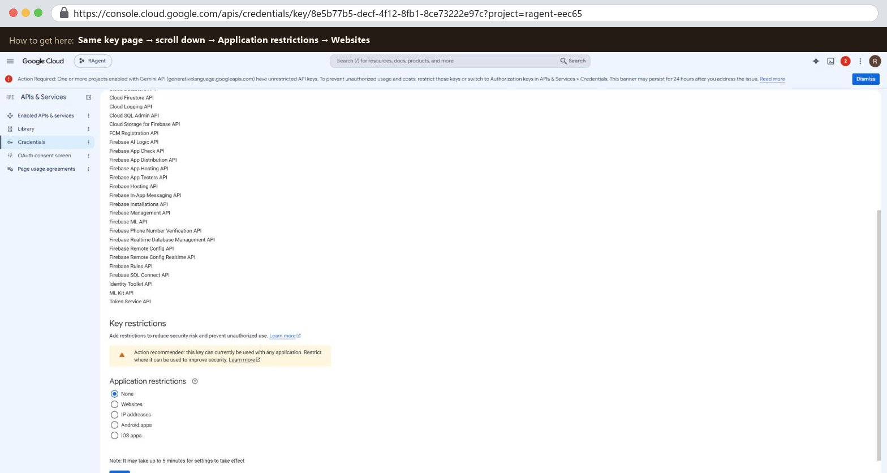

## 11. Troubleshooting: every error we hit

| Symptom | Cause | Fix |
|---|---|---|
| `firebase login` fails: "Failed to make request to auth.firebase.tools/attest" | A corporate proxy (Zscaler) re-signs HTTPS and Node doesn't trust it | `set NODE_OPTIONS=--use-system-ca` before Firebase commands |
| `firebase deploy` → `ERR_REQUIRE_ESM … build.mjs not supported` and `Node.js v20.18.2` | Run from the standalone "Firebase CLI" window, which bundles an old Node | Use a normal Command Prompt (Node 22) with the npm-installed `firebase` |
| `npm test` fails with a "test/" path error | Node 22's `--test` doesn't take a folder | The script is just `node --test` (it finds `*.test.js`) |
| Step 2 says "Setup needed: add your App Check reCAPTCHA site key…" after deploying | Browser cached the old `ai-config.js` (Hosting allowed 1 hour of caching) | Ctrl+Shift+R. Fixed for good with `no-cache` headers in `firebase.json` |
| "The model refused the request because App Check isn't set up" (`403 PERMISSION_DENIED`) | App Check not registered or not enforced, or the domain isn't on the reCAPTCHA key | Re-check steps 6–8; wait a few minutes after enforcing |
| "The free model quota is used up for now" (`429`) | Free-tier limit for that model reached | Wait a minute, or use `gemini-3.5-flash-lite` |
| "The model is busy right now" (`500`/`503`, "high demand") | Google-side load on that model | Retry later, or use `gemini-3.5-flash-lite` |
| `404 … model is no longer available` / `not found` | Model retired or not offered on the free tier | Pick a current model and set `MODEL` in `ai-config.js` |

## 12. Everyday commands

```bat
cd "C:\Users\<you>\Documents\Personal\Raghu\FDE\Evolution\RAgents"
set NODE_OPTIONS=--use-system-ca

rem Run all tests, then preview at http://127.0.0.1:5000 (Ctrl+C to stop)
npm test
npm run serve

rem Save to GitHub
git add -A
git commit -m "Describe the change"
git push

rem Publish to https://ragent-eec65.web.app
firebase deploy --only hosting
```

**Adding the next step:** copy the latest folder in `projects/` (e.g. → `03-chat-with-history`), set the next `step`
number and the text in its `project.json`, change the code, then test and deploy. It appears in the left nav automatically.
